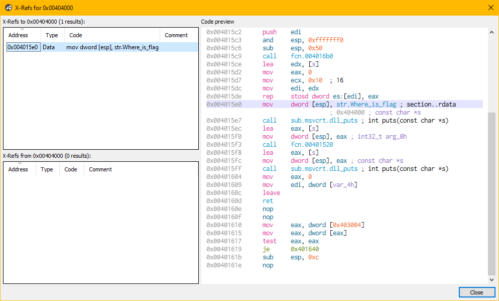
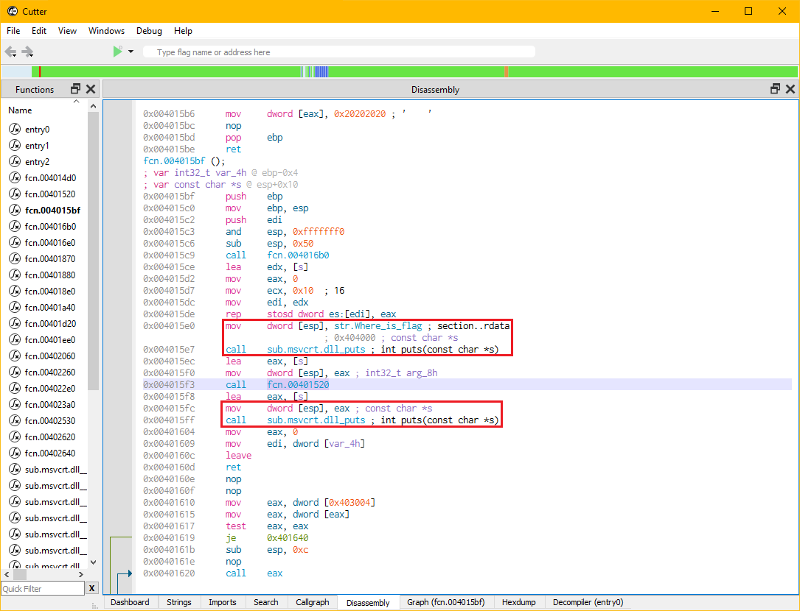
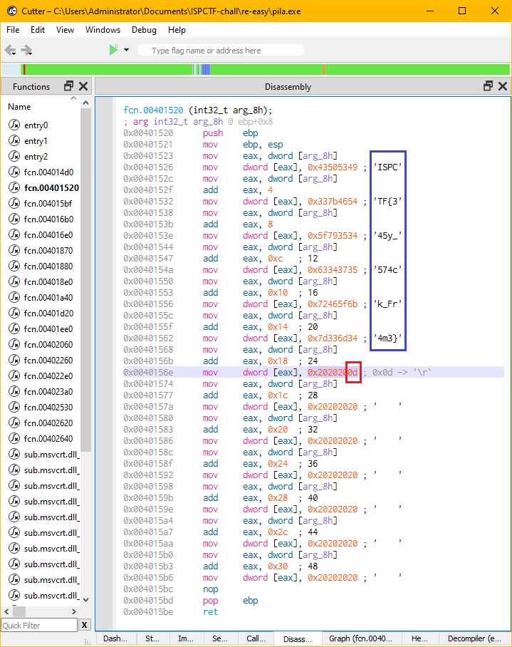

# Pila

Chạy thử chương trình thu được:
```txt
Where is flag?


```

Mở file trong Cutter (có thể dùng các trình disassembler khác như: Ghidra, IDA)

Tìm string `Where is flag?` và tìm xem hàm nào đã gọi string này



Thấy string này được gọi duy nhất ở địa chỉ `0x004015e0`, nhảy tới hàm chứa địa chỉ này



Tại `fcn.004015bf()` thấy rằng sau khi in ra string `Where is flag?`
còn một lần nữa hàm `puts` được gọi ở bên dưới, và trước hàm `puts` có gọi `fcn.00401520`
và hàm này trả về string để hàm `puts` in ra màn hình. Nhảy đến `fcn.00401520()`



Thấy rằng có string được đưa vào stack nhưng do kí tự '/r' đã đưa con trỏ về đầu string
sau đó ghi đè lên là các kí tự space nên khi chạy không thấy được flag.

Flag: `ISPCTF{345y_574ck_Fr4m3}`
