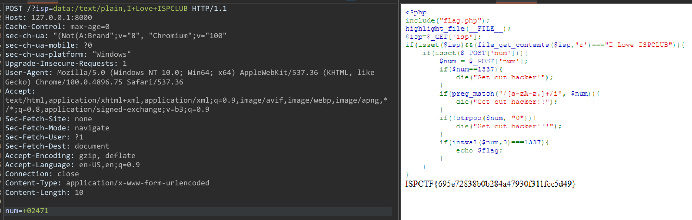

# Web01
Chall 1 đoạn code PHP
```php
<?php
include("flag.php");
highlight_file(__FILE__);
$isp=$_GET['isp'];
if(isset($isp)&&(file_get_contents($isp,'r')==="I Love ISPCLUB")){
    if(isset($_POST['num'])){
        $num = $_POST['num'];
        if($num==1337){
            die("Get out hacker!");
        }
        if(preg_match("/[a-zA-z.]+/i", $num)){
            die("Get out hacker!!");
        }
        if(!strpos($num, "0")){
            die("Get out hacker!!!");
        }
        if(intval($num,0)===1337){
            echo $flag;
        }
    }
}
```
Với đoạn if kiểm tra biến isp nhận được bằng với đoạn text `I Love ISPCLUB` thông qua hàm `file_get_contents`
> isp=data:/text/plain,I Love ISPCLUB

Biến num nhận dữ liệu từ POST
Với `if($num==1337)` loại bỏ biến num=1337
Với `if(preg_match("/[a-zA-z.]+/i", $num))` loại bỏ các kí tự chữ và '.' trong biến num
Với `if(!strpos($num, "0"))` loại bỏ chữ số 0 đứng đầu
của biến num

Với `if(intval($num,0)===1337)`
Hàm intval trong PHP có cú pháp là `int intval($var , $base=10)` có biến $base là biến chứa tham số cần chuyển đổi mặc định là cơ số 10

Nếu như base=0 thì kết quả cơ số trả về theo định dạng của var
Ở đây biến $var không thể là dạng hex vì là 0x bị filter ở trên
Do vậy biến var là dạnh octal là 0
Nhưng chữ số 0 không thể ở đầu => để kí tự đầu tiên là khoảng trắng
> num= 02471



> Flag: ISPCTF{695e72838b0b284a47930f311fcc5d49}