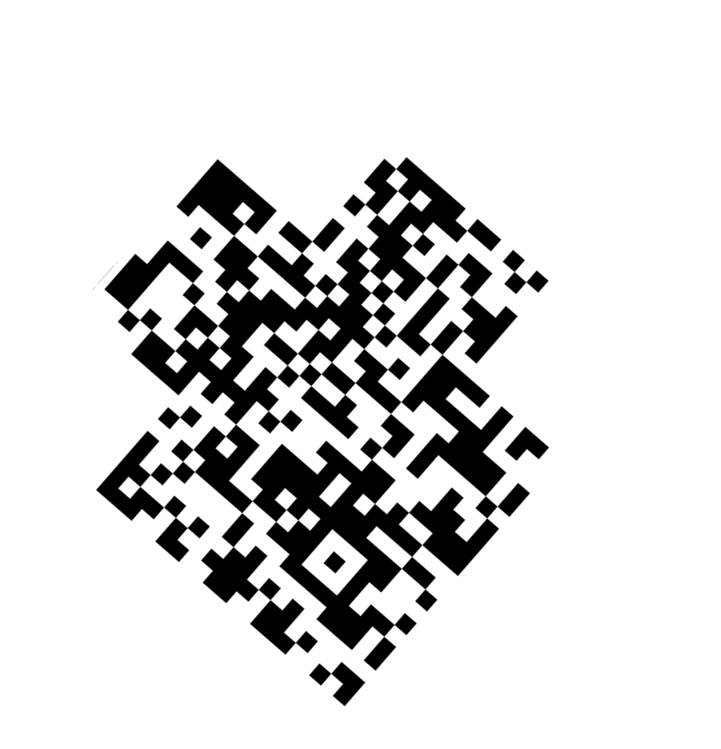
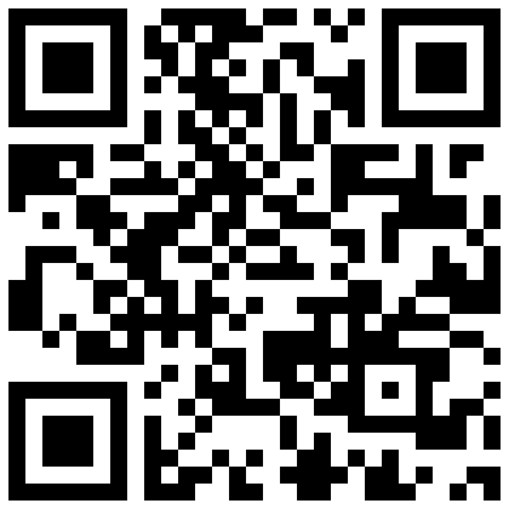
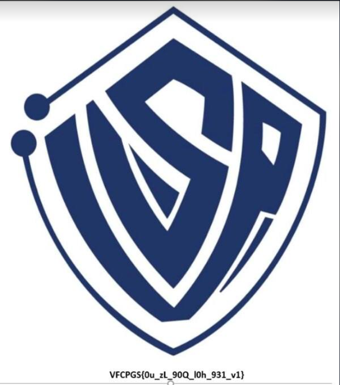
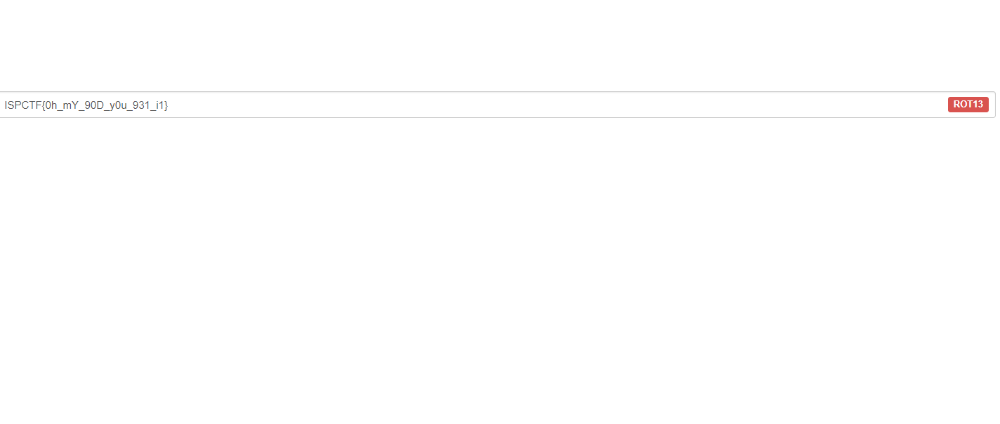

# Crypto: ROTTOR

#### Challegen

Xipan đã tạo ra mê cung nhằm đánh lạc hướng chúng ta, các bạn hãy theo Bốp để không bị lạc nhé!

[Sau.png](Sau.png)

#### Solution

Tác giả đã cho ta 1 bức ảnh trông khá ngộ nghĩnh, trông khá giống là 1 mã QR, nhưng khi quét thì không được gì?? Lúc này, hint nói rằng "Bạn có biết định dạng chuẩn của 1 mã QR không?" thì sau 1 hồi học về QR thì mình biết mã này bị khuất mất 3 ô vuông định vị ở 3 góc. Việc cần làm lúc này là chèn thêm 3 ô vuông đó vào cho đúng vị trí của nó thôi :D Sau khi photoshop thì ta đã có 1 mã QR hoàn chỉnh:

Sau khi quét thì nhận được 1 bức ảnh với 1 dòng chữ bên dưới trông có vẻ giống form Flag nhưng đã bị mã hóa

Lúc này mình mới nhớ tên Chall là ROTTOR nên chắc rằng nó có liên quan tới chìa khóa để giải mã dòng chữ kia, tra thêm 1 tí thì mình biết nó được mã hóa bằng mã ROT13

Flag: `ISPCTF{0h_mY_90D_y0u_931_i1}`