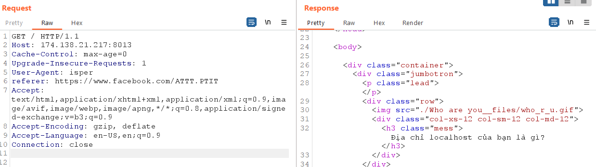
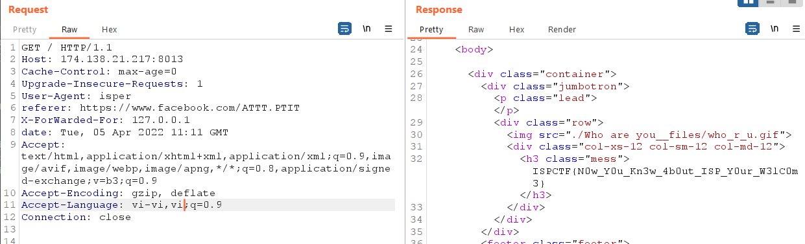

# ISP Info

Khi Inspect trang, một message bị ẩn xuất hiện

- 

Có vẻ message này chỉ chấp nhận `User-agent` là `isper`, bật burpsuite và thay đổi `user-agent` thành `isper`

- 

Một message nữa đã xuất hiện, server đang muốn kiểm tra xem nguồn đưa bạn đến trang web này có được cho phép hay không  

Thêm 1 trường nữa cho header: `referer: https://www.facebook.com/ATTT.PTIT`
- 

Sau khi send, ta lại nhận được một message nữa: `'Địa chỉ localhost của bạn?'` chắc chắn là `127.0.0.1`

- Server sẽ forward nếu cung cấp đúng IP, thêm 1 trường nữa vào header: `X-ForWarded-For: 127.0.0.1` Nhấn send ta được : 

-   

Lần này server yêu cầu ngày tháng, và ngày tháng đó chính là ngày thành lập khoa ATTT. 
- Osint theo link gợi ý ta tìm được bài viết có ngày, tháng, năm: <a href="https://portal.ptit.edu.vn/hoc-vien-cong-nghe-buu-chinh-vien-thong-thanh-lap-khoa-an-toan-thong-tin/">Link bài viết</a>

- 

 Thêm trường `date` có dạng sau: `date: Tue, 05 Apr 2022 11:11 GMT`
 Sau đó send: 

 Lần này lại là `'bạn có biết tiếng Việt không?'` Ta chỉ cần sửa lại phần `Accept-Language` thành `vi-VN,vi` 
 Nhưng mà send xong không ra cái gì :( , author thật nhiễu sự, phải là `vi-vi,vi` thì mới được cơ (chỉ muốn xin 100 điểm hint của các bạn thui ^^). 
 Và cuối cùng `Accept-Language: vi-vi,vi`  
 Sau khi send thì ta có được flag:

-  

>Flag: `ISPCTF{N0w_Y0u_Kn3w_4b0ut_ISP_Y0ur_W3lC0m3}`

