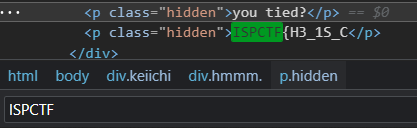
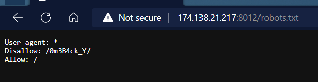
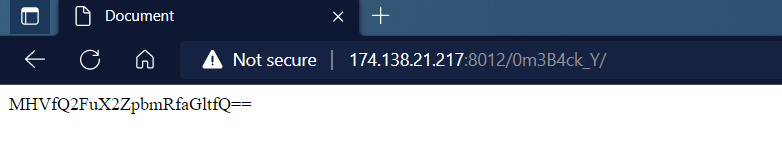
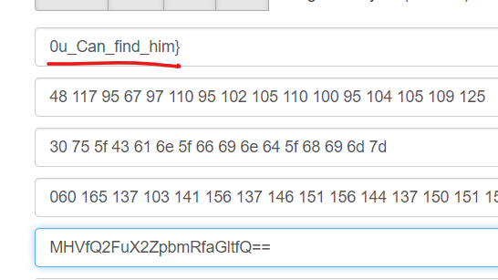

# Keiichi
Mới đầu vào ta chỉ thấy một bức ảnh làm background, thử inspect xem sources thì ối dồi ôi luôn, một đống code html, có vẻ như flag được giấu ở đây.  
`Ctrl F ISPCTF` ta tìm được phần đầu của Flag: `ISPCTF{H3_1S_C`
- 

Nếu như phần Flag còn lại cũng nằm trong source này thì chắc chắn là không tìm ra được, cả source đều là html, hoàn toàn không thể khai thác được gì. 
Lúc này ta cần nghĩ tới file ẩn. Truớc khi nghĩ tới các cách để tìm file ẩn như Bruteforce. Ta cần kiểm tra file `Robots.txt` :)) 
> Tệp `robots.txt` cho trình thu thập dữ liệu của công cụ tìm kiếm biết có thể truy cập vào những URL nào trên trang web của bạn. Tệp này chủ yếu dùng để ngăn trình thu thập dữ liệu gửi quá nhiều yêu cầu cho trang web; `đây không phải là cơ chế để ẩn một trang web khỏi Google`. Để ẩn một trang web khỏi Google, hãy chặn lập chỉ mục bằng noindex hoặc bảo vệ trang đó bằng mật khẩu.

> Boom 
- 
- Disallow: `0m3B4ck_Y`, file này đã bị web ẩn đi, và nhìn nó cũng giống với 1 phần của Flag phết nhỉ :))

> Flag lúc này có thêm 1 phần mới: `ISPCTF{H3_1S_C0m3B4ck_Y` 

Truy cập vào file `0m3B4ck_Y` bị ẩn này ta thấy trang có nội dung sau: 
- 

>  Encode: `MHVfQ2FuX2ZpbmRfaGltfQ==`

Nhìn đoạn mã kia có vẻ bị như message ban đầu bị `encode Base64`, dễ dàng decode với <a href="https://kt.gy/tools.html#conv/0u_Can_find_him%7D">kt.gy</a>  

- Ta thu được kết quả: 

- > `0u_Can_find_him}`

 Ghép các phần tìm được, ta có Flag hoàn cỉnh:  
>Flag: `ISPCTF{H3_1S_C0m3B4ck_Y0u_Can_find_him}`
