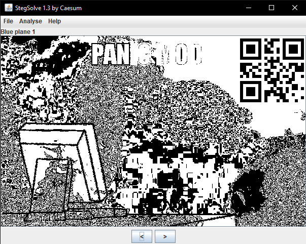
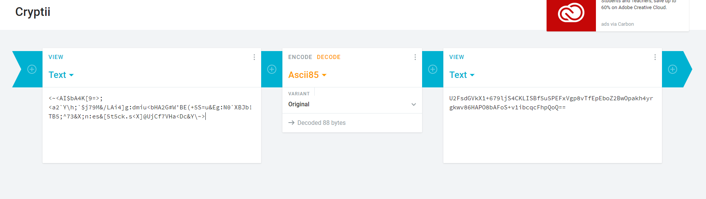
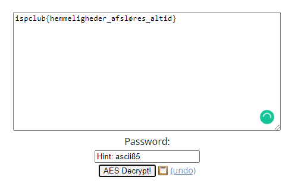

# trainingCTF2020

Writeup dành cho các challenges trong thời gian Training của Gen II CLB ISP.

## Overview
 | Title | Category  | Flag |
 | ------ | ------ | ------ |
 | [Sudoku](#1-sudoku) | Programming | `ispclub{5ud0ku_puzzl3_15_n0t_345y}` |
 | [Super panic](#2-super-panic) | Forensic | `ispclub{h3y_br0_c4lm_d0wn}` |
 | [pyRev](#3-pyrev) | Programming | `ispclub{5up3r_345Y_cH4ll3ng3}` |
 | [shiftNbases](#4-shiftnbases) | Crypto | `ispclub{Tat_ca_moi_nguoi_deu_sinh_ra_co_quyen_binh_dang._Tao_hoa_cho_ho_nhung_quyen_khong_ai_co_the_xam_pham_duoc;_trong_nhung_quyen_ay,_co_quyen_duoc_song,_quyen_tu_do_va_quyen_muu_cau_hanh_phuc._Loi_bat_hu_ay_o_trong_ban_Tuyen_ngon_Doc_lap_nam_1776_cua_nuoc_My._Suy_rong_ra,_cau_ay_co_y_nghia_la:_tat_ca_cac_dan_toc_tren_the_gioi_deu_sinh_ra_binh_dang,_dan_toc_nao_cung_co_quyen_song,_quyen_sung_suong_va_quyen_tu_do._Ban_Tuyen_ngon_Nhan_quyen_va_Dan_quyen_cua_Cach_mang_Phap_nam_1791_cung_noi:_Nguoi_ta_sinh_ra_tu_do_va_binh_dang_ve_quyen_loi;_va_phai_luon_luon_duoc_tu_do_va_binh_dang_ve_quyen_loi._Do_la_nhung_le_phai_khong_ai_choi_cai_duoc.}` |
 | [ascii64+](#5-ascii64+) | Web | `ispclub{hemmeligheder_afsløres_altid}` |

# 1. Sudoku

#### Challenge

[Source](./writeupfiles/sudoku.cpp)

#### Solution

Đầu tiên mình chạy thử code và nhận được output sau:

```sh
C:\ISP\source-code\TrainingGII>Sudoku.exe
ispclub{d0_y0u_l1k3_5ud0ku?}
(Y or N)? ====> Answer: N

ispclub{y0u_d0_n0t_g3t_th3_fl4g}
  
C:\ISP\source-code\TrainingGII>Sudoku.exe
ispclub{d0_y0u_l1k3_5ud0ku?} 
(Y or N)? ====> Answer: Y

ispclub{l3t'5_try_4_puzzl3!}

--------------------------
| 7 0 0 | 6 0 0 | 2 0 3 |
| 0 2 0 | 8 1 0 | 0 5 0 |
| 0 0 5 | 0 9 2 | 0 0 0 |
--------------------------
| 2 0 0 | 0 7 0 | 5 0 8 |
| 3 0 7 | 0 0 9 | 0 2 0 |
| 0 9 0 | 0 4 0 | 0 0 7 |
--------------------------
| 1 0 8 | 0 3 7 | 0 0 2 |
| 0 0 0 | 1 0 0 | 8 0 0 |
| 6 0 2 | 0 0 0 | 9 3 0 |
--------------------------
Try again
```

Sau khi chạy cả 2 trường hợp "Y" và "N" mình nhận được tất cả 3 flag giả:

```sh
  ispclub{d0_y0u_l1k3_5ud0ku?} 
  ispclub{l3t'5_try_4_puzzl3!}
  ispclub{y0u_d0_n0t_g3t_th3_fl4g}
```

Cùng check qua source code xem ta sẽ thu được gì:
- Dòng 20: *string sudoku="..."*  có 81 ký tự = 9x9. Có thể suy ra đây là ma trận sudoku.
- Dòng 37: *sudoku[++c]-97* dùng để chuyển các ký tự từ chữ về số theo mã ASCII.
- Dòng 42 - 45: Ta thấy string flag4 phụ thuộc vào các string flag1, flag2, flag3 và "sudoku". 
- Dòng 47: *if (flag4.size()==34) cout << flag4 << endl;*  nếu size flag4 bằng đúng với 34 ( = với size của flag4 dòng 19) thì sẽ in ra flag4. Vậy ta kết luận flag4 là flag của bài.  

Bây giờ ta phải đi giải bài sudoku này, thay các giá trị 0 bằng những số thích hợp. Ta chuyển dãy sudoku ấy về xâu chữ cái với *‘0’ = ’a’, ’1’ = ’b’, ’2’ = ’c’,...* Mình dùng 1 script `python` để làm việc này:

```sh
C:\ISP\source-code\TrainingGII>python
Python 3.7.7
Type "help", "copyright", "credits" or "license" for more information.
>>> sudoku="haagaacadacaibaafaaafajcaaacaaahafaidahaajacaajaaeaaahbaiadhaacaaabaaiaagacaaajda"    <-- input string
>>> for i in sudoku:
...     print(ord(i)-97,end='')
...
700600203020810050005092000200070508307009020090040007108037002000100800602000930    <-- output string
>>>
```

Sau đó các bạn có thể tìm tool hoặc giải tay để luyện thêm trí não, còn ở đây mình tìm thấy 1 tool giúp giải sudoku khá tiện và mình đã chỉnh sửa lại để phù hợp giải chall này:

[soduku-solve.py](./writeupfiles/soduku-solve.py)

```sh
C:\ISP\source-code\TrainingGII\>python Sudoku-solver.py
hbjgfecidecgibdhfjidfhjcebgcgedhbfjidihfgjbcefjbceidghbfijdhgecjedbcgihfghceifjdb   <-- output string
C:\ISP\source-code\TrainingGII\>
```

Sau đó thay chuỗi vừa tìm được vào source code challenge ban đầu và chạy lại:

```sh
C:\ISP\source-code\TrainingGII>Sudoku.exe
ispclub{d0_y0u_l1k3_5ud0ku?}
(Y or N)? ====> Answer: Y

ispclub{l3t'5_try_4_puzzl3!}

--------------------------
| 7 1 9 | 6 5 4 | 2 8 3 |
| 4 2 6 | 8 1 3 | 7 5 9 |
| 8 3 5 | 7 9 2 | 4 1 6 |
--------------------------
| 2 6 4 | 3 7 1 | 5 9 8 |
| 3 8 7 | 5 6 9 | 1 2 4 |
| 5 9 1 | 2 4 8 | 3 6 7 |
--------------------------
| 1 5 8 | 9 3 7 | 6 4 2 |
| 9 4 3 | 1 2 6 | 8 7 5 |
| 6 7 2 | 4 8 5 | 9 3 1 |
--------------------------
ispclub{5ud0ku_puzzl3_15_n0t_345y}
```

Flag: `ispclub{5ud0ku_puzzl3_15_n0t_345y}`

# 2. Super panic

#### Challenge

[Super-panic](./writeupfiles/panic.jpg)

#### Solution

Trước tiên mình sẽ check file bằng tool [stegsolve](http://www.caesum.com/handbook/Stegsolve.jar) và mình đã tìm thấy 1 QR code:



Sau khi quét QR mình tìm được `ispclub{h3y_br0_` điều này có nghĩa là vẫn còn 1 nửa flag nữa còn thiếu. Mình đã quyết định check ảnh bằng HxD.

Phần mở đầu của file khá bình thường khi mà mình không thấy có điểm gì kì lạ:

```
89 50 4E 47 0D 0A 1A 0A | 00 00 00 0D 49 48 44 52
         ^                         ^
   PNG signature               IHDR chunk
```

Mọi việc kiểm tra các chunk đều bình thường cho đến khi mình check IEND chunk:

```
49 45 4E 44 AE 42 60 82 | 00 00 00 9D FF F3 08 2A 82 A0 08 2A
         ^                                 ^
     IEND chunk                  Đoạn hex phía sau IEND chunk
```

Một bức ảnh png sẽ kết thúc ở IEND và những thứ sau đó sẽ không được hiện thị nhưng ở bức ảnh này vẫn còn thêm 1 đoạn hex khá dài ở phía sau nữa nên mình liền nghĩ tới là chèn ảnh vào ảnh và mình đã check thử xem có tìm thấy file signature không. Và kết quả là không tìm ra gì cả. Cho đến khi mình check từ phía dưới lên:

`10 00 64 94 64 A4 01 00 0E FF 8D FF` mình nhận thấy có điểm gì đó lạ ở đây và mình đã đúng `FF D8 FF E0 00 10 4A 46 49 46 00 01 <-- JPG signature` vậy là đây là mã hex của 1 bức ảnh bị đảo sau đó chèn vào.

Vậy thì đảo nó lại để lấy ảnh thôi!

Ở đây mình đã copy toàn bộ mã hex của cả 2 bức ảnh để đảo, ở đây mình tạm gọi phần trên là pic1 phần dưới là pic2 và nó bị đảo nên sẽ là pic2rev-ed.

Vậy ta sẽ có như sau:

```
    - Ảnh gốc         sau khi đảo toàn bộ hex       Ảnh sau đảo
    pic1-pic2rev                -->                pic2-pic1rev
```

Vì toàn bộ sau khi đảo thì dữ liệu của pic2 sẽ được hiển thị và pic1 sẽ bị ngắt bởi end của pic2 giống như ban đầu khi ta chỉ thấy pic1 vậy.

*Ảnh jpg có kết thúc là FF D9 vậy nên không cần lo chuyện sẽ có lỗi khi reverse toàn bộ bức ảnh*

Mình đã copy toàn bộ mã hex của ảnh và dùng tool [Online hex tools](https://onlinehextools.com/reverse-hex-digits) để reverse toàn bộ mã hex sau đó copy trở lại HxD và save thành file có đuôi JPG:


Vậy là đã tìm thấy phần còn lại của flag: `c4lm_d0wn}`

Flag: `ispclub{h3y_br0_c4lm_d0wn}`

# 3. pyRev

#### Challenge

[pyRev.py](./writeupfiles/pyRev.py)

Mới đầu nhìn vào ta có thẻ thấy được bài này sủ dụng rất nhiều hàm. Vậy nên mình đã liệt kê các hàm ra và bắt đầu phân tích:

```py
def ispclub(cre):
def prompt():
def obfuscate(bys):
def crypt(sor):
def grant():
def punish():
def main():
```

Ta có thể thấy `main()` là hàm được gọi đầu tiên để thực thi. Hãy cùng phân tích `main()`:

```py
def main():
  sik1 = prompt()
  sik = obfuscate(sik1)
  sik = crypt(sik)
  sik = ispclub(sik)
  if (sik=="61ch4ll691ch4l..."):
    grant()
  else:
    punish()
```

Mình đã tạm thời bỏ câu lệnh `if` và chạy thử in ra ouput thì nhận được 1 string có cấu trúc khá giống với string được đem so sánh trong câu lệnh `if` vậy nên để có thể lấy được flag thì nhiệm vụ chính là reverse dòng string được đem ra để so sánh trong câu lệnh `if`.

Khi xem xét thì ta có thể thấy:

- `sik1 = prompt()`: Gọi đến 1 hàm input
- `obfuscate() | crypt() | ispclub()`: các hàm để encode string được input
- `if (sik=="...")`: So sánh string sau khi encode với 1 string khác, đúng -> `grant()`, sai -> `punish()`
Okay, giờ đến phân tích sâu vào nào.  
`grant()` và `punish()` là 2 hàm xuất thông báo khi kiểm tra điều kiện và cái ta muốn là hàm `grant()` được thực thi, đồng nghĩa với điều kiện kiểm tra trong `ìf` phải.


Hai hàm trên khá đơn giản nên mình sẽ không phân tích nhiều và tập trung vào các hàm dùng để encode. Và mình đã tách từng hàm và chạy riêng để phân tích vì các hàm này không liên quan đến nhau.
  
Đầu tiên là `ispclub()`

```sh
C:\ISP\source-code\TrainingGII>python
Python 3.7.7
Type "help", "copyright", "credits" or "license" for more information.
>>> def ispclub(cre):				<-- input "ABCD"
...     sto=[]					
...     gre=""      
...     for i in cre:				<-- với vòng lặp đầu
...             sto.append(i+str(len(i)))	<-- sto = ['A1']
...             sto.append("ch4ll"+i)		<-- sto = ['A1', 'ch4llA']
...     for i in sto:				<-- sto = ['A1', 'ch4llA', 'B1', 'ch4llB', 'C1', 'ch4llC', 'D1', 'ch4llD']
...             gre+=i
...     return gre
...
>>> ispclub("ABCD")				<-- input
'A1ch4llAB1ch4llBC1ch4llCD1ch4llD'		<-- output
>>>
```

Ta có thể dễ dàng thấy được các ký tự mà ta cần sẽ các nhau 1 khoảng bằng 8. Từ đó mình có đoạn code sau:

```py
>>> def solve_ispclub(indata):
...     return indata[::8]			<-- string[start:end:step]
...
>>>
```

Kết quả chạy hàm:

```py
>>> solve_ispclub('A1ch4llAB1ch4llBC1ch4llCD1ch4llD') 	<-- input
'ABCD'							<-- output
>>>
```

Tiếp đến là hàm `crypt()`
  
```py
>>> def crypt(sor):				<-- input "ABCD"
...     sro=[]					<-- sro = []
...     fusc="696"
...     for i in range(len(sor)):
...             sro.append(sor[i]+str(i))	<-- sro = ['A0', 'B1', 'C2', 'D3']
...     sro.reverse()				<-- sro = ['D3', 'C2', 'B1', 'A0']
...     for i in sro:
...             fusc+=i
...     return fusc				<-- fusc = "696" + "D3C2B1A0"
...
>>> crypt("ABCD")				<-- input "ABCD"
'696D3C2B1A0' 					<-- output string
>>>
```

Đầu tiên cần loại bỏ `696` ở đầu string, tiếp đó là đảo lại và lấy các ký tự ở vị trí thứ 2. Từ đó sẽ có:

```py
>>> def solve_crypt(indata):	# indata = "696D3C2B1A0"
... 	out=""
... 	indata = indata[3:]	# indata = "D3C2B1A0"
... 	indata = indata[::-1]	# indata = "0A1B2C3D"
... 	cnt=1			# tạo biến đếm
... 	while (len(indata)): 	# Lặp lần đầu
... 		out+=indata[1]	# lấy ký tự thứ 2(indata[1]="A")
... 		indat=indata[len(str(cnt))+1:] 	<-- indata = "1B2C3D"
... 		cnt+=1
... 	return out
...
>>>
```

Kết quả chạy hàm:

```py
>>> solve_crypt('696D3C2B1A0') 	<-- input
'ABCD'				<-- output
```

Lý do cần thêm biến `cnt` là vì `crypt()` chạy vòng lặp từ `0` đến `len(sor)` nếu lặp lớn hơn 10 thì `len(sor)` sẽ lớn hơn 1.  

Tiếp đến là `obfuscate()`:

```py
>>> import base64 as isp 				# import base64 và rename thành isp
>>> def obfuscate(bys):
...     fusc = isp.b64encode(bys)			# fusc = b'QUJDRA=='
...     fusc += b"ispclub6910832"			# fusc = b'QUJDRA==ispclub6910832'
...     fusc = str(fusc)				# <class 'bytes'> đổi thành <class 'str'>
...     fusc = fusc[2:len(fusc)-1]			# loại bỏ prefix, fusc = "QUJDRA==ispclub6910832"
...     refus = []
...     for i in fusc:
...             refus.append(str(i))			
...             fusc="imustDOTHISCHALL011014"		# lưu giá trị vào refus, fusc="imustDOTHISCHALL011014"
...     for i in refus:
...             fusc+=i 				# fusc = "imustDOTHISCHALL011014" + "QUJDRA==ispclub6910832"
...     return fusc
...
>>> obfuscate(b'ABCD')				<-- input
'imustDOTHISCHALL011014QUJDRA==ispclub6910832'	<-- output
>>>
```

Vậy hàm `obfuscate()` chỉ đơn giản là encode base64 và thêm 2 chuỗi vào đầu và cuối. Từ đó hàm solve sẽ là:

```py
>>> def solve_obfuscate(indata):
...     indata = indata.replace("imustDOTHISCHALL011014",'') 	# indata = "QUJDRA==ispclub6910832"
...     indata = indata.replace("ispclub6910832",'')		# indata = "QUJDRA=="
...     indata = indata.encode('utf-8')			        # indata = b'QUJDRA=='
...     return str(base64.b64decode(indata))			# decode indata và return giá trị 
...
>>>
```

Kết quả chạy hàm:

```py
>>> solve_obfuscate('imustDOTHISCHALL011014QUJDRA==ispclub6910832')  <-- input 
"b'ABCD'"							     <-- output
>>>
```

Bước cuối cùng là ghép các hàm đã tạo ra để tạo file [solve1](./writeupfiles/pyrev-solve1.py) và chạy với input là string bên trong câu lệnh `ìf`.

*Các bạn cũng có thể tham khảo file [solve2](./writeupfiles/pyrev-solve2.py) này*

Flag: `ispclub{5up3r_345Y_cH4ll3ng3}`  

# 4. ShiftNbases  

#### Challenge

Cháu ngoan Bác Hồ thì phải luôn ghi nhớ 19051890!

[ciphertext](./writeupfiles/shiftNbases.txt)

#### Solution
  
Bài này mình sử dụng `python3.7` để viết script decode.  
  
Trong file được cho chứa một chuỗi số khá dài, nhìn qua thì có cả mã hex. Phán đoán bước đầu, đây sẽ là text sau khi đã encode bằng các base cơ bản.

Trong các base cơ bản, có các khoảng giá trị đặc biệt cần chú ý như sau:

```sh
| ASCII | OCT | DEC | HEX |
|------|------|------|------|
| All | `1o` - `377o` | `1d` - `255d` | `1h` - `ffh` |
| `A` - `z` | `101o` - `172o` | `65d` - `122d` | `41h` - `7ah` |
| `0` - `9` | `60o` - `71o` | `48d` - `57d` | `30h` - `39h` |
```

Sau khi xem xét kỹ lưỡng, ta nhận ra đoạn text có vẻ được mã hóa theo quy luật `oct - dec - hex - dec`. Bởi, các số thứ 0, 4, 8,... thường có giá trị lớn nhất, trùng với khoảng giá trị các chữ cái trong hệ `oct`, số thứ 1, 3, 5, 7, 9,.. thường trùng với khoảng giá trị các chữ cái trong hệ `dec`, và các số thứ 2, 6, 10,... thường khá nhỏ so với các giá trị khác, và trùng với khoảng giá trị các chữ cái trong hệ `hex`.

Decode thử xem ra gì?

```py
f = open("shiftNbases.txt", "r")
cipher = f.read().split()
f.close()
base = [8, 10, 16, 10]
text = ""
for i in range(0, len(cipher)):
    text += chr(int(cipher[i], base[i % 4]))
    
print(text)
```  

Và ta được output trông như thế này:  

```
ISP_IN_YOUR_AREAh|phk}Y{SjtdbiVmnr_sf}fi^mez^{ISP_IN_YOUR_AREA`nghrf^kf_p~yjmgYimq_i`v^.^]atISP_IN_YOUR_AREA^pfa^lht^pf_mqusfghuxnndjpfnfhISP_IN_YOUR_AREAan^kf_sqedwid_oqar^llobD_yqwegISP_IN_YOUR_AREA^whzmoVqtes^ip,^lodp}pemhdznkISP_IN_YOUR_AREAVsnwg1^ylydw_ytg[o^adp}pemhmzISP_IN_YOUR_AREAtgZathhfmpVpg~c3^Tfi^kay^pl_`ISP_IN_YOUR_AREA_t^|iomp_g`vVTtes^v^omhDtbgcaISP_IN_YOUR_AREAohnflg(76?_htiVntxcdL%_R~ydqwISP_IN_YOUR_AREAeg^{a1^kXu^jydbwVy^wgmhiVl`C_yISP_IN_YOUR_AREA`|Vc`hcfbg[amhttbgkrdw_ygmVghxISP_IN_YOUR_AREAidcml_rrnm^zX_arnm^lXnf5_i`vVtISP_IN_YOUR_AREAnl_s`wVctwgdbwVqtes^{fnf5_vtISP_IN_YOUR_AREA\n^|usfgjunwgduiVqtes^|l_cx.dISP_IN_YOUR_AREAAie_S~yjmgegnw_Sgie_p~yjmgma^MISP_IN_YOUR_AREAas^ylydw_htiVC`lhdlieg^YhfogeaISP_IN_YOUR_AREAlh1<89Vctwgdmw`:^WgznqVt`hsnmpISP_IN_YOUR_AREAVr`htz^lf_uj_ghv__cjnl^~\_p~yjISP_IN_YOUR_AREAmgcohD_{`ggh`r_qtwe_k~os^llobhISP_IN_YOUR_AREAtz^lf_uj_ghv__cjnl^~\_p~yjmgcoISP_IN_YOUR_AREAh7_Ingca^whzmoVldhpm`qVkgxnl^iISP_IN_YOUR_AREA`_bqon^kXi^mutb6t
```  

Một chuỗi text dài các ký tự kỳ quặc và chèn thêm rất nhiều chuỗi `ISP_IN_YOUR_AREA`. Hẳn là chuỗi này chỉ có tác dụng obfuscate đoạn cipher thôi. Bỏ nó đi:  

```py
text = text.replace('ISP_IN_YOUR_AREA', '')
```  

Vấn đề còn lại là decrypt đoạn text còn lại sau khi đã deobfuscate. Tên đề bài là `shift and bases`, bước đầu đã là trộn các base, vậy bước này là một dạng của `shifting cipher`?

Flag có form `ispclub{this_is_flag}`. Vậy chắc chắn những ký tự đầu `h|phk}Y{` sau khi decode sẽ phải là `ispclub{`.

Phân tích quy luật của nó:

```sh
| Plaintext | Ciphertext |
| ------ | ------ |
| `i` - `105d` | `h` - `104d` |
| `s` - `115d` | `\|` - `124d` |
| `p` - `112d` | `p` - `112d` |
| `c` - `99d` | `h` - `104d` |
| `l` - `108d` | `k` - `107d` |
| `u` - `117d` | `}` - `125d` |
| `b` - `98d` | `Y` - `89d` |
| `{` - `123d` | `{` - `123d` |  
```

Vậy là có liên quan tới con số `19051890` thật. Cụ thể:

- `i` - `1` = `h`
- `s` + `9` = `|`
- ...

Vậy là các ký tự sẽ được shift theo quy luật dãy số `19051890`, xen kẽ `-` và `+`.

Tiếp tục decode:

```py
shiftkey = '19051890'
for i in range(0, len(text)):
    if i % 2 == 0:
        plain += chr(ord(text[i]) + int(shiftkey[i % 8]))
    else:
        plain += chr(ord(text[i]) - int(shiftkey[i % 8]))
```  

[source](./writeupfiles/shiftNbases.py)

Flag:
```
ispclub{Tat_ca_moi_nguoi_deu_sinh_ra_co_quyen_binh_dang._Tao_hoa_cho_ho_nhung_quyen_khong_ai_co_the_xam_pham_duoc;_trong_nhung_quyen_ay,_co_quyen_duoc_song,_quyen_tu_do_va_quyen_muu_cau_hanh_phuc._Loi_bat_hu_ay_o_trong_ban_Tuyen_ngon_Doc_lap_nam_1776_cua_nuoc_My._Suy_rong_ra,_cau_ay_co_y_nghia_la:_tat_ca_cac_dan_toc_tren_the_gioi_deu_sinh_ra_binh_dang,_dan_toc_nao_cung_co_quyen_song,_quyen_sung_suong_va_quyen_tu_do._Ban_Tuyen_ngon_Nhan_quyen_va_Dan_quyen_cua_Cach_mang_Phap_nam_1791_cung_noi:_Nguoi_ta_sinh_ra_tu_do_va_binh_dang_ve_quyen_loi;_va_phai_luon_luon_duoc_tu_do_va_binh_dang_ve_quyen_loi._Do_la_nhung_le_phai_khong_ai_choi_cai_duoc.}
```

# 5. ascii64+

#### Challenge

[snyde.js](./writeupfiles/snyde.js)

#### Solution

Bài này cơ bản việc chúng ta phải làm đó là decode đoạn output:

```
<~<AI$bA4K[9=>;<a2`Y\h;`$j79M&/LAi4]g:dmiu<bHA2G#W'BE(+5S=u&Eg:N0`XBJb!TB5;^73&X;n:es&[5t5ck.s<X]@UjCf7VHa<Dc&Y\~>
```

Để output ra mình sẽ kiểm tra function checkPass khi function này trả về true thì kết quả mới trả về output đúng của chương trình.

Đầu vào là 2 giá trị `username` và `password` kiểu tra giá trị đúng trả về `true`

```js
for (let i = 0; i < user.length; i++) {
    if ((username.charCodeAt(i) + password.charCodeAt(i) + i * 10) !== key_check.charCodeAt(i)) {
        return false
    }
}
```

`password` là thứ mình phải tìm. Method `charCodeAt(i)` trả về mã ascii của kí tự tại vị trí `i` trong chuỗi.

Example: Có chuỗi `isp` mình muốn chuyển thành các kí tự ascii.

```sh
| character | ascii code |
|-----------|------------|
| i         | 105        |
| s         | 115        |
| p         | 112        |
```

Muốn tìm được `pass` mình sẽ reverse phép toán trên bằng cách:

```js
key_check.charCodeAt(i) - i * 10 - user.charCodeAt(i)
```

Kết quả trả về là mã ascii của kí tự tại vị trí `i` của biến `pass`.

Đầu xuôi đuôi lot rồi bây giờ mình sẽ dùng hàm `String.fromCharCode(char)` để trả về character với mã ascii tương ứng

Mình sẽ viết lại code như sau:

```js
let pass = ''
for (let i = 0; i < user.length; i++) {
    pass += String.fromCharCode(key_check.charCodeAt(i) - i * 10 - user.charCodeAt(i))   
}
console.log(pass)
```

Done, kết quả thu được giá trị của `pass` là `Hint: ascii85`.

Wow, người ra đề thật là thú vị đề bài vừa là hint lại vừa là đáp án

```js
const { encode } = require('./ascii.js')
```

Đây chắc chắn là hàm encode base85

Đến lúc decode, mình sử dụng https://cryptii.com/pipes/ascii85-encoding



Thu được chuỗi sau khi decode:
```
U2FsdGVkX1+679ljS4CKLISBf5u5PEFxVgp8vTfEpEboZ2BwOpakh4yrgkwv86HAPO8bAFoS+v1ibcqcFhpQoQ==
```

`CryptoJS` là một thư viện hỗ trợ rất nhiều các công cụ mã hóa cho javascipt. `AES` là một trong số các thuật toán mã hóa khối phổ biến hiện nay. 

Mã hóa này vừa có thể mã hóa và vừa có thể giải mã...

Thông tin thêm: https://vi.wikipedia.org/wiki/Advanced_Encryption_Standard

Mình sẽ decrypt chuỗi trên với `pass` tìm được ban nãy, sử dụng: https://www.browserling.com/tools/aes-decrypt



Done :3, flag tìm được: `ispclub{hemmeligheder_afsløres_altid}`

Solved Python: [snyde-solve.py](./writeupfiles/snyde-solve.py)

